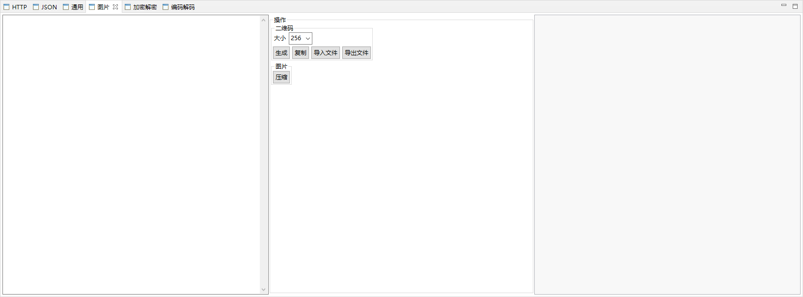

<h1 align="center">Ding（鼎）</h1>

Eclipse开发工作常用功能插件

----

## 版本

|软件|版本|
|:--|:--|
|JDK|17+|
|Eclipse|4+|

#### 下载链接

[https://pan.baidu.com/s/1q501IH3IOn5eef9pRlpX0A](https://pan.baidu.com/s/1q501IH3IOn5eef9pRlpX0A)

提取密码：cybu

#### 使用方法

1. 解压文件
2. 打开Eclipse
3. Help -> Install New Software...
4. 选择解压文件目录

## 功能

|功能|描述|状态|
|:--|:--|:--:|
|通用|-|√|
|-|屏幕取色|√|
|-|颜色转换|√|
|-|定时休息|√|
|-|护眼模式|x|
|-|编码调整|x|
|-|字体调整|x|
|-|正则表达式匹配|√|
|-|正则表达式提取|√|
|图片|-|√|
|-|压缩|√|
|-|二维码|√|
|JSON|-|√|
|-|对比|√|
|-|压缩|√|
|-|格式化|√|
|-|URL转换|√|
|HTTP|-|√|
|-|模拟请求|√|
|编码解码|-|√|
|-|Hex|√|
|-|URL|√|
|-|Base64|√|
|-|Unicode|√|
|加密解密|-|√|
|-|散列计算|√|
|-|加密解密|√|
|-|证书工具|√|
|-|签名验签|√|
|功能优化|-|√|
|-|打开Server原始目录|√|
|-|打开Server部署目录|√|

*√=完成、○-进行中、×-未开始*

#### 注意事项

* 证书工具：生成、导入、导出
* 加密算法：AES/DES/RSA
* 散列算法：MD5/SHA-1/SHA-256/SHA-512
* HTTP支持参数：表单/文本
* HTTP支持方法：GET/PUT/POST/DELETE
* 如果没有结果可以打开`Error Log View`查看错误日志

## 捐赠

[捐赠](https://www.acgist.com/sponsor)

[服务器](https://www.acgist.com/collect/server)

## 界面

