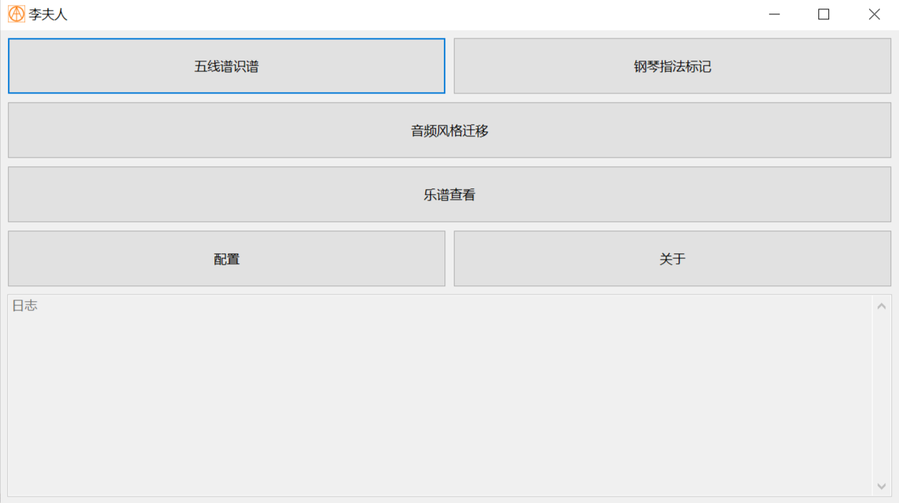
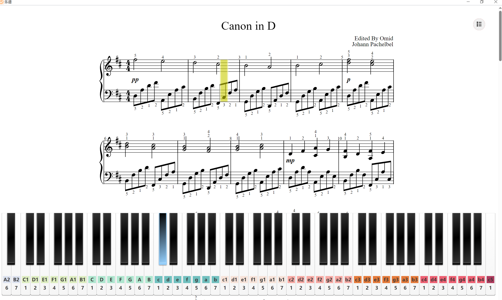

# 李夫人

```
北方有佳人，绝世而独立。
一顾倾人城，再顾倾人国。
宁不知倾城与倾国，佳人难再得。
```

**学习`AI`相关知识，搞点东西练手，主要功能：图片识谱、指法标记、音频风格迁移。**

> 如果需要编辑谱面建议使用`musescore`专业编辑软件💃💃💃

----

<p align="center">
    <a target="_blank" href="https://starchart.cc/acgist/lifuren">
        
    </a>
    
    <br />
    
    
    
    
</p>

## 模块

|模块|名称|详细描述|
|:--|:--|:--|
|docs|项目文档|项目文档|
|deps|依赖项目|依赖项目|
|boot|基础模块|项目配置、基础工具|
|core|核心模块|模型训练、模型推理|
|client|接口模块|`CLI`接口、`GUI`接口|

## 结构

```
+-+-+-+-+-+-+-+-+-+-+-+-+-+-+-+-+-+-+-+-+-+-+-+-+-+-+-+-+-+-+-+-+
|       |                         client                        |
|       +-+-+-+-+-+-+-+-+-+-+-+-+-+-+-+-+-+-+-+-+-+-+-+-+-+-+-+-+
|       |           CLI             |           GUI             |
|       +-+-+-+-+-+-+-+-+-+-+-+-+-+-+-+-+-+-+-+-+-+-+-+-+-+-+-+-+
|       |                          core                         |
|       +-+-+-+-+-+-+-+-+-+-+-+-+-+-+-+-+-+-+-+-+-+-+-+-+-+-+-+-+
| C/C++ |           audio           |           image           |
|       +-+-+-+-+-+-+-+-+-+-+-+-+-+-+-+-+-+-+-+-+-+-+-+-+-+-+-+-+
|       |      ffmpeg     |      libtorch     |      opencv     |
|       +-+-+-+-+-+-+-+-+-+-+-+-+-+-+-+-+-+-+-+-+-+-+-+-+-+-+-+-+
|       |                          boot                         |
|       +-+-+-+-+-+-+-+-+-+-+-+-+-+-+-+-+-+-+-+-+-+-+-+-+-+-+-+-+
|       |      spdlog     |      yaml-cpp     |     tinyxml2    |
+-+-+-+-+-+-+-+-+-+-+-+-+-+-+-+-+-+-+-+-+-+-+-+-+-+-+-+-+-+-+-+-+
```

## 文档

* [学习资料](./docs/AI.md)
* [命令文档](./docs/CLI.md)
* [计划文档](./docs/TODO.md)
* [模型文档](./docs/Model.md)
* [部署文档](./docs/Deploy.md)

## 主要功能

|任务|当前状态|详细描述|
|:--|:--:|:--|
|肖邦|○|五线谱识谱|
|师旷|○|音频风格迁移|
|莫扎特|○|钢琴指法标记|
|乐谱显示|○|简谱和五线谱|
|钢琴键盘|√||
|钢琴演奏|√||
|`CLI`接口|√|命令行接口|
|`GUI`接口|√|图形化接口|
|模型部署|○|`TensorRT`/`OnnxRuntime`|

*√ - 完成、○ - 实现、# - 等待、? - 待定、~ - 忽略*

> 简谱显示找找有没有好用的开源库，自己写了一半太费时间就放弃了。

## 界面



